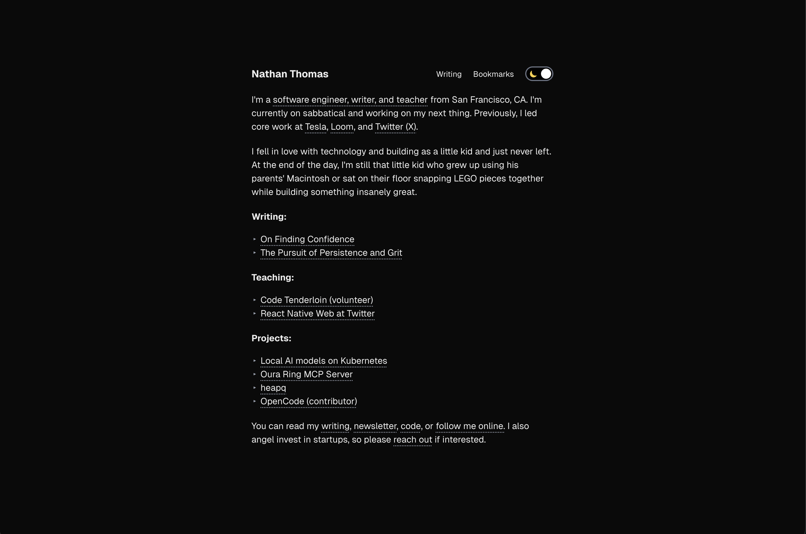

# Personal Website

This is my personal website, a place for my writing and thoughts to live.



## Table of Contents

- [Getting Started](#getting-started)
- [Project Management](#project-management)
- [Technology Stack](#technology-stack)
- [Acknowledgements](#acknowledgements)

## Getting Started

First, [install bun](https://bun.com).

Next, clond down this repository and run the following command to install dependencies:

```bash
make install
```

After that, you should be able to go ahead and start up the dev environment server by running:

```bash
make dev
```

It's recommended to set up a `.env` file modeled after the `.env.example` in the root of this repository if you want Sentry functionality, but the basic site will still run without that in place.

## Project Management

You can find work for this repository in this [Trello board](https://trello.com/b/48bwZhhe/nathans-personal-website).

## Technology Stack

- [Focus Trap React](https://github.com/focus-trap/focus-trap-react)
- [NextJS](https://nextjs.org)
- [NextJS MDX](https://www.npmjs.com/package/@next/mdx)
- [NextJS SEO](https://github.com/garmeeh/next-seo)
- [Redux](https://redux.js.org)
- [Sentry](https://sentry.io/welcome)
- [Tanstack Query](https://tanstack.com/query/latest)
- [TypeScript](https://www.typescriptlang.org)
- [Vercel](https://vercel.com)

## ACKNOWLEDGEMENTS

- Thanks to my parents for supporting me. I couldn't have done it without you.
