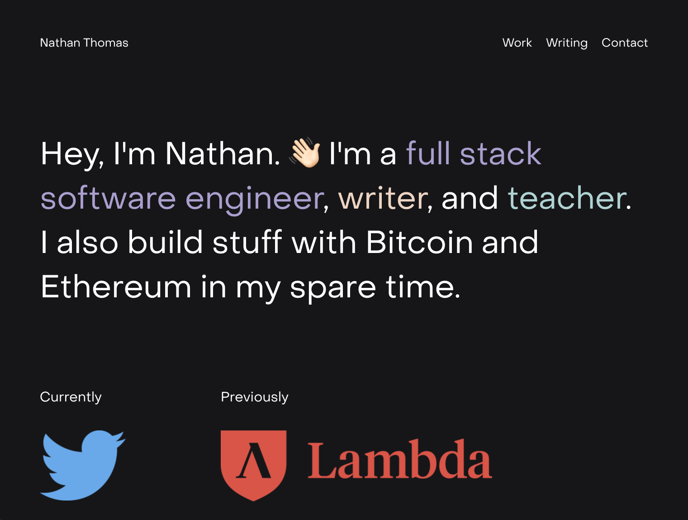

# Personal Website 👁👄👁

## GETTING STARTED 💭

This is the Github repository for my personal website. The entire site revolves around the idea of content discoverability, as I built it to allow others to more easily consume content that I create.

Also, making this site gave me the opportunity to really stretch out and craft a site that felt was mine.

Welcome. I hope you enjoy the site as much as I enjoyed making it.

## TABLE OF CONTENTS 📚

- [Getting Started](#getting-started)
- [Technology Stack](#technology-stack)
- [Unit Testing](#unit-testing)
- [Acknowledgements](#acknowledgements)

## TECHNOLOGY STACK 👨🏻‍💻

I tried to use a completely modern tech stack while testing out some new technologies that I'd never used before. This resulted in a fast, performant, and easily-extensible web app that should be fairly future proof for the coming years. I used:

- Front-End:
  - [Next.js](https://nextjs.org/)
  - [Styled Components](https://styled-components.com/)
- Back-end:
  - `Coming Soon`

## UNIT TESTING 🧪

- `COMING SOON`

## ACKNOWLEDGEMENTS 🎉

- Thanks to my parents for supporting my journey of learning to code. I couldn't have done it without you.
- Thanks [Lambda School](https://lambdaschool.com/) for teaching me the skills that allow me to build applications just like this one.
- Thanks to [Zach Cole](http://zcole.me/index.html) for some of the inspiration behind my site.
- Thanks to [Medium](https://medium.com/) for inspiring my article layout.
