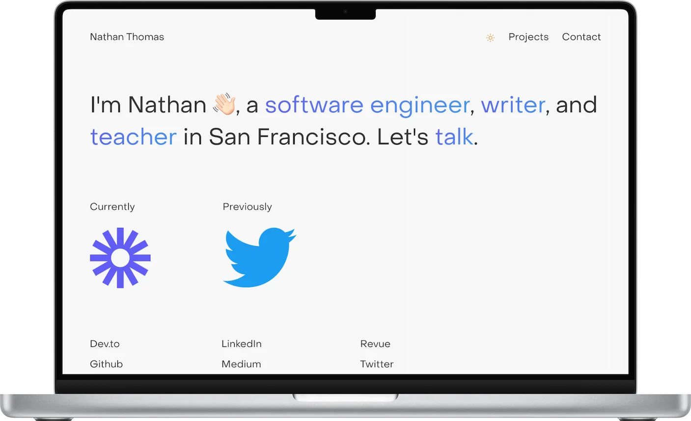

# Personal Website 👁👄👁

## GETTING STARTED 💭

This is the Github repository for my personal website. Making this site gave me the opportunity to really stretch out and craft a site that I felt was mine.

Welcome. I hope you enjoy this site as much as I enjoyed making it.

## TABLE OF CONTENTS 🌀

- [Getting Started](#getting-started)
- [Technology Stack](#technology-stack)
- [Unit Testing](#unit-testing)
- [Acknowledgements](#acknowledgements)

## TECHNOLOGY STACK 👨🏻‍💻

I tried to use a completely modern tech stack while testing out some new technologies that I'd never used before. This resulted in a fast, performant, and easily-extensible web app that should be fairly future-proof for the coming next several years. I used:

- Front-End:
  - [Axios](https://axios-http.com/docs/intro)
  - [Focus Trap React](https://github.com/focus-trap/focus-trap-react)
  - [Formik](https://formik.org/)
  - [Next.js](https://nextjs.org/)
  - [Redux](https://redux.js.org/)
  - [Sentry](https://sentry.io/welcome/)
  - [Styled Components](https://styled-components.com/)
  - [TypeScript](https://www.typescriptlang.org/)
  - [Vercel (main deploy)](https://vercel.com/)
  - [Yup](https://github.com/jquense/yup)
- Back-end:
  - [Docker](https://www.docker.com/)
  - [Express](https://expressjs.com/)
  - [Nodemailer](https://github.com/nodemailer/nodemailer)
  - [TypeScript](https://www.typescriptlang.org/)

## UNIT TESTING 🧪

- Front-end:
  - `COMING SOON`™
- Back-end:
  - `COMING SOON`™

## ACKNOWLEDGEMENTS 🎉

- Thanks to my parents for supporting my journey of learning to code. I couldn't have done it without you.
- Thanks to [Zach Cole](http://zcole.me/index.html) for some of the inspiration behind my site.
- Thanks to [Uniswap](https://uniswap.org/) for the inspiration on my contact form
